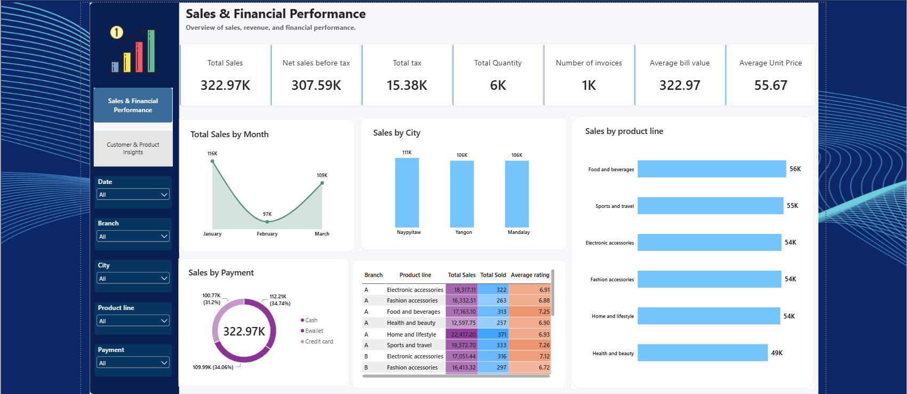
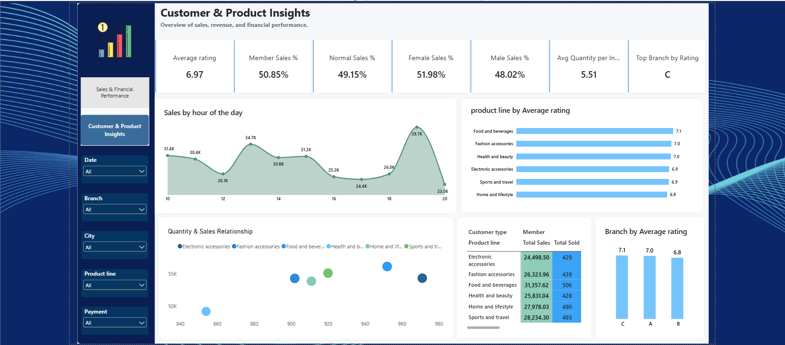

# 📊 Supermarket Business Intelligence & Analytics Dashboard

An end-to-end **Business Intelligence & Data Analytics** project built with **Microsoft Power BI** to analyze supermarket sales performance, customer behavior, product-line performance, payment methods, and customer satisfaction.

The dashboard transforms transactional retail data into actionable business insights through interactive KPIs, analytical visuals, and cross-dimensional analysis.

---

## 🖼️ Dashboard Preview

### Sales & Financial Performance



### Customer & Product Insights



---

## 📌 Project Overview

This project presents an interactive **two-page Power BI dashboard** designed to provide a comprehensive view of supermarket operations.

The analysis focuses on:

* 💰 Sales & financial performance
* 📈 Monthly and hourly sales trends
* 🏪 Branch and city performance
* 🛍️ Product-line performance
* 👥 Customer type and gender analysis
* 💳 Payment method analysis
* ⭐ Customer satisfaction and ratings
* 📦 Quantity and transaction behavior

The dashboard enables users to explore performance across multiple dimensions using interactive filters and visualizations.

---

## 🎯 Business Objectives

The main objectives of this project are to:

* Monitor overall sales performance through key financial KPIs.
* Identify the highest-performing cities, branches, and product lines.
* Analyze customer purchasing behavior.
* Understand customer membership and demographic patterns.
* Identify peak sales hours and periods.
* Evaluate customer satisfaction across branches and product lines.
* Analyze payment method preferences.
* Identify relationships between sales, quantity, price, and ratings.

---

## 📊 Dashboard Pages

### 1. Sales & Financial Performance

This page provides a high-level overview of revenue generation, transaction volume, tax, product performance, payment methods, and geographic sales distribution.

#### Key Performance Indicators

| KPI                    |    Value |
| ---------------------- | -------: |
| **Total Sales**        | $322.97K |
| **Sales Before Tax**   | $307.59K |
| **Total Tax**          |  $15.38K |
| **Total Quantity**     |       6K |
| **Number of Invoices** |       1K |
| **Average Bill Value** |  $322.97 |
| **Average Unit Price** |   $55.67 |

#### Key Visualizations

**Total Sales by Month**

* January generated approximately **$116K** in sales.
* February recorded approximately **$97K**.
* March recovered to approximately **$109K**.

**Sales by City**

| City      | Sales |
| --------- | ----: |
| Naypyitaw | $111K |
| Yangon    | $106K |
| Mandalay  | $106K |

Sales are relatively balanced across the three cities.

**Sales by Product Line**

* **Food and Beverages:** ~$56K
* **Sports and Travel:** ~$55K
* **Electronic Accessories:** ~$54K

**Sales by Payment Method**

| Payment Method |  Share |
| -------------- | -----: |
| E-wallet       | 34.74% |
| Credit Card    | 34.06% |
| Cash           | 31.20% |

The payment analysis provides insight into customer payment preferences and digital-payment adoption.

**Branch & Product Line Matrix**

A detailed matrix compares:

* Branch
* Product Line
* Total Sales
* Quantity Sold
* Average Rating

This enables users to drill down from branch-level performance into individual product categories.

---

### 2. Customer & Product Insights

This page focuses on customer behavior, purchasing patterns, sales timing, product ratings, and branch satisfaction.

#### Key Performance Indicators

| KPI                              |     Value |
| -------------------------------- | --------: |
| **Average Rating**               | 6.97 / 10 |
| **Member Sales %**               |    50.85% |
| **Normal Sales %**               |    49.15% |
| **Female Sales %**               |    51.98% |
| **Male Sales %**                 |    48.02% |
| **Average Quantity per Invoice** |      5.51 |
| **Top Branch by Rating**         |  Branch C |

#### Key Visualizations

**Sales by Hour of the Day**

The hourly sales analysis highlights periods with higher sales activity.

* **14:00 (2 PM):** ~$34.7K
* **19:00 (7 PM):** ~$39.7K

This analysis can help management understand daily demand patterns and plan operational resources accordingly.

**Product Line by Average Rating**

* **Food and Beverages:** ~7.1
* **Home and Lifestyle:** ~6.8

This visualization compares customer satisfaction across product categories.

**Quantity & Sales Relationship**

A scatter plot examines the relationship between:

* Quantity Sold
* Total Sales

This helps identify product lines that generate high sales through either higher sales volume or higher transaction value.

**Customer Type Breakdown**

The dashboard compares **Member** and **Normal** customers across product lines using:

* Sales
* Quantity Sold
* Customer Type

**Branch by Average Rating**

| Branch   | Average Rating |
| -------- | -------------: |
| Branch C |            7.1 |
| Branch A |            7.0 |
| Branch B |            6.8 |

---

## 💡 Key Business Insights

### 1. Peak Sales Periods

Sales activity is concentrated around specific hours, particularly **2 PM and 7 PM**.

This provides a basis for analyzing staffing requirements and operational capacity during higher-demand periods.

### 2. Product Performance

**Food and Beverages** represents one of the strongest product lines in terms of sales and also records a relatively high average customer rating.

### 3. Customer Membership

Member and Normal customers contribute relatively similar portions of total sales:

* Members: **50.85%**
* Normal customers: **49.15%**

This indicates a relatively balanced customer mix between the two customer types.

### 4. Payment Behavior

Digital payment methods account for a significant portion of transactions:

* E-wallet: **34.74%**
* Credit Card: **34.06%**

Together, they represent approximately **68.8%** of sales.

### 5. Branch Satisfaction

Branch-level ratings show differences in average customer satisfaction, with Branch C recording the highest average rating among the three branches in this dataset.

---

## 📈 Business Recommendations

Based on the dashboard analysis:

1. **Staffing & Operations**
   Review staffing levels around high-activity periods such as 2 PM and 7 PM.

2. **Product Management**
   Monitor high-performing product lines and evaluate opportunities for inventory optimization and assortment expansion.

3. **Customer Loyalty**
   Analyze the conversion of Normal customers into Members through targeted loyalty initiatives.

4. **Digital Payments**
   Monitor the reliability and availability of digital payment channels due to their significant contribution to sales.

5. **Customer Experience**
   Investigate differences in branch and product-line ratings to identify potential customer-experience improvement areas.

---

## 💾 Dataset Overview

The project uses the `supermarket.csv` dataset containing transactional records from three supermarket branches located in:

* Naypyitaw
* Yangon
* Mandalay

### Dataset Fields

| Field             | Description                   | Data Type   |
| ----------------- | ----------------------------- | ----------- |
| **Invoice ID**    | Unique transaction identifier | Text        |
| **Branch**        | Store branch identifier       | Categorical |
| **City**          | Store location                | Categorical |
| **Customer Type** | Member or Normal customer     | Categorical |
| **Gender**        | Customer gender               | Categorical |
| **Product Line**  | Product category              | Categorical |
| **Unit Price**    | Price per unit                | Numeric     |
| **Quantity**      | Number of units purchased     | Numeric     |
| **Tax 5%**        | Transaction tax               | Numeric     |
| **Total**         | Total transaction amount      | Numeric     |
| **Date**          | Transaction date              | Date        |
| **Time**          | Transaction time              | Time        |
| **Payment**       | Payment method                | Categorical |
| **cogs**          | Cost of goods sold            | Numeric     |
| **gross income**  | Gross income                  | Numeric     |
| **Rating**        | Customer rating               | Numeric     |

---

## 🧮 Power BI Measures

The dashboard uses DAX measures to calculate key business metrics, including:

* Total Sales
* Total COGS
* Total Tax
* Total Gross Income
* Total Quantity
* Total Invoices
* Average Invoice Value
* Average Unit Price
* Average Rating
* Member Sales %
* Normal Sales %
* Female Sales %
* Male Sales %
* Average Quantity per Invoice
* Top Product Line
* Top Branch by Rating

These measures allow the dashboard to dynamically respond to filters and slicers.

---

## 🛠️ Tools & Technologies

| Tool                 | Purpose                                 |
| -------------------- | --------------------------------------- |
| **Power BI Desktop** | Dashboard development & visualization   |
| **DAX**              | Measures and business calculations      |
| **Power Query**      | Data transformation and preparation     |
| **Excel / CSV**      | Source data                             |
| **GitHub**           | Project version control & documentation |

---

## 📂 Repository Structure

```text
Supermarket-Business-Intelligence/
│
├── Dashboard Supermarket.pbix
├── supermarket.csv
├── num1.png
├── num.png
└── README.md
```

### File Description

* `Dashboard Supermarket.pbix` — Interactive Power BI dashboard.
* `supermarket.csv` — Raw transactional dataset.
* `num1.png` — Sales & Financial Performance dashboard screenshot.
* `num.png` — Customer & Product Insights dashboard screenshot.
* `README.md` — Project documentation.

---

## 🚀 How to Run the Project

### 1. Clone the Repository

```bash
git clone https://github.com/ahmedelsayeddev1/YOUR-REPO-NAME.git
```

### 2. Install Power BI Desktop

Download and install **Microsoft Power BI Desktop**.

### 3. Open the Dashboard

Open:

```text
Dashboard Supermarket.pbix
```

### 4. Explore the Dashboard

Use the available:

* Filters
* Slicers
* Charts
* KPI Cards
* Tables
* Interactive visualizations

to explore the dataset and analyze supermarket performance.

---

## 📌 Project Highlights

* Interactive **2-page Power BI dashboard**
* Financial and operational KPI analysis
* Customer segmentation analysis
* Product-line performance analysis
* Branch and city comparison
* Hourly and monthly sales analysis
* Payment-method analysis
* Customer satisfaction analysis
* DAX-based business calculations
* Interactive filtering and drill-down analysis

⭐ If you find this project useful, feel free to explore the dashboard and review the analysis.
